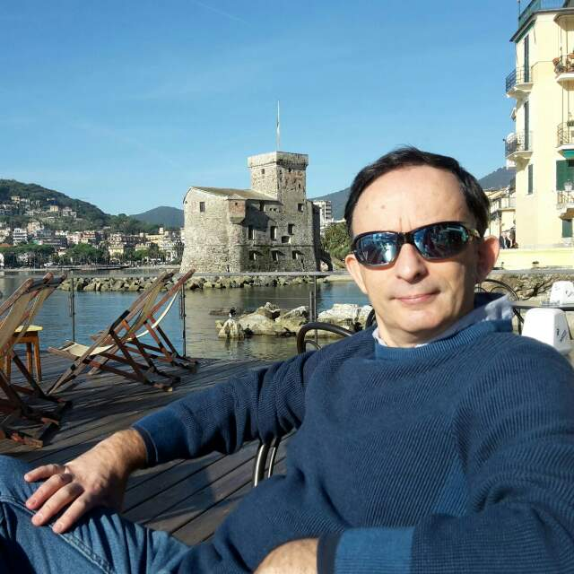

# About me

I am a software analyst, architect and developer involved in web-based applications, mainly Java Enterprise solutions in the Health, Insurance, Government and Banking domains.

Test-Driven Development (TDD) and software testing methodologies and techniques are my main interests, without forgetting about coding and code quality.

Follow me on [Twitter](https://twitter.com/gualtierotesta)

Complete profile on [LinkedIn](https://www.linkedin.com/in/gualtierotesta)

I work and live close to Milan, Italy.

